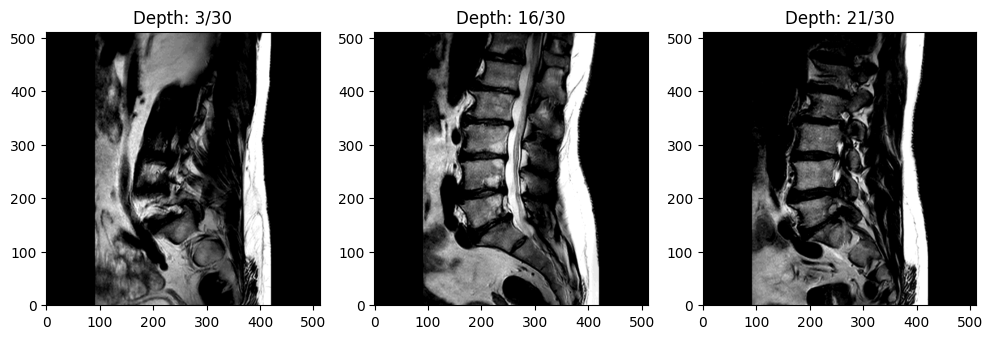
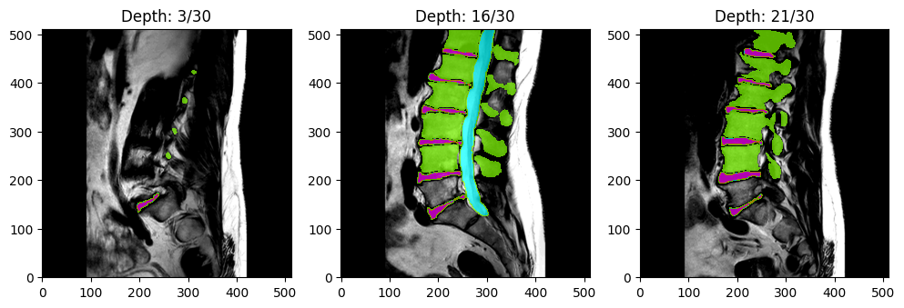

# Spine Segmentation: Discs, Vertebrae and Spinal Canal (SPIDER)

The SPIDER dataset contains (human) lumbar spine magnetic resonance images (MRI) and segmentation masks described in the following paper:

- van der Graaf, J.W., van Hooff, M.L., Buckens, C.F.M. et al. *Lumbar spine segmentation in MR images: a dataset and a public benchmark.*
  Sci Data 11, 264 (2024). https://doi.org/10.1038/s41597-024-03090-w

Original data are available on [Zenodo](https://zenodo.org/records/10159290). More information can be found at [SPIDER Grand Challenge](https://spider.grand-challenge.org/).

<figure>
  
  <figcaption>Example MRI scan (at three different depths)</figcaption>
</figure>

<figure>
  
  <figcaption>Example MRI scan with segmentation masks</figcaption>
</figure>

# Dataset Description

- **Published Paper:** [Lumbar spine segmentation in MR images: a dataset and a public benchmark](https://www.nature.com/articles/s41597-024-03090-w)
- **ArXiv Link:** https://arxiv.org/abs/2306.12217
- **Repository:** [Zenodo](https://zenodo.org/records/8009680)
- **Grand Challenge:** [SPIDER Grand Challenge](https://spider.grand-challenge.org/)

# Tutorials

In addition to the information in this README, several detailed tutorials for this dataset are provided in the [tutorials](tutorials) folder:

1. [Loading the SPIDER Dataset from HuggingFace](tutorials/load_data.ipynb)
2. [Building a U-Net CNN Model for Magnetic Resonance Imaging (MRI) Segmentation](tutorials/UNet_SPIDER.ipynb)

<br>

# Table of Contents (TOC)

1. [Getting Started](https://huggingface.co/datasets/cdoswald/SPIDER#getting-started)
   
2. [Dataset Summary](https://huggingface.co/datasets/cdoswald/SPIDER#dataset-summary)
   
3. [Data Modifications](https://huggingface.co/datasets/cdoswald/SPIDER#data-modifications)
   
4. [Dataset Structure](https://huggingface.co/datasets/cdoswald/SPIDER#dataset-structure)
   
    - [Data Instances](https://huggingface.co/datasets/cdoswald/SPIDER#data-instances)
   
    - [Data Schema](https://huggingface.co/datasets/cdoswald/SPIDER#data-schema)
   
    - [Data Splits](https://huggingface.co/datasets/cdoswald/SPIDER#data-splits)
   
5. [Image Resolution](https://huggingface.co/datasets/cdoswald/SPIDER#image-resolution)

6. [Additional Information](https://huggingface.co/datasets/cdoswald/SPIDER#additional-information)
    
    - [License](https://huggingface.co/datasets/cdoswald/SPIDER#license)
   
    - [Citation](https://huggingface.co/datasets/cdoswald/SPIDER#citation)
   
    - [Disclaimer](https://huggingface.co/datasets/cdoswald/SPIDER#disclaimer)
  
    - [Known Issues/Bugs](https://huggingface.co/datasets/cdoswald/SPIDER#known-issuesbugs)

<br>

# Getting Started

First, you will need to install the following dependencies:

* `datasets >= 2.18.0`
* `scikit-image >= 0.19.3`
* `SimpleITK >= 2.3.1`

Then you can load the SPIDER dataset as follows:

```python
from datasets import load_dataset
dataset = load_dataset("cdoswald/SPIDER, name="default", trust_remote_code=True)
```

See the [Loading the Dataset](tutorials/load_data.ipynb) tutorial for more information.

# Dataset Summary

The dataset includes 447 sagittal T1 and T2 MRI series collected from 218 patients across four hospitals.
Segmentation masks indicating the vertebrae, intervertebral discs (IVDs), and spinal canal are also included.
Segmentation masks were created manually by a medical trainee under the supervision of a medical imaging expert and an experienced musculoskeletal radiologist.

In addition to MR images and segmentation masks, additional metadata (e.g., scanner manufacturer, pixel bandwidth, etc.), limited
patient characteristics (biological sex and age, when available), and radiological gradings indicating specific degenerative
changes can be loaded with the corresponding image data.

# Data Modifications

This version of the SPIDER dataset (i.e., available through the HuggingFace `datasets` library) differs from the original 
data available on [Zenodo](https://zenodo.org/records/8009680) in two key ways:

1. Image Rescaling/Resizing: The original 3D volumetric MRI data are stored as .mha files and do not have a standardized height, width, depth, and image resolution. 
To enable the data to be loaded through the HuggingFace `datasets` library, all 447 MRI series are standardized to have height and width of `(512, 512)` and (unsigned) 16-bit integer resolution.
Segmentation masks have the same height and width dimension but are (unsigned) 8-bit integer resolution.
The depth dimension has not been modified; rather, each scan is formatted as a sequence of `(512, 512)` grayscale images, where the index in the sequence indicates the depth value.
N-dimensional interpolation is used to resize and/or rescale the images (via the `skimage.transform.resize` and `skimage.img_as_uint` functions). 
If you need a different standardization, you have two options:

    i. Pass your preferred height and width size as a `Tuple[int, int]` to the `resize_shape` argument in `load_dataset` (see the [LoadData Tutorial](placeholder)); OR
	
	ii. After loading the dataset from HuggingFace, use the `SimpleITK` library to import each image using the file path of the locally cached .mha file. 
	The local cache file path is provided for each example when iterating over the dataset (again, see the [LoadData Tutorial](placeholder)).

2. Train, Validation, and Test Set: The original dataset contained 257 unique studies (i.e., patients) that were partitioned into 218 (85%) studies for the public training/validation set
and 39 (15%) studies for the SPIDER Grand Challenge [hidden test set](https://spider.grand-challenge.org/data/). To enable users to train, validate, and test their models prior to submitting
their models to the SPIDER Grand Challenge, the original 218 studies that comprised the public training/validation set were further partitioned using a 60%/20%/20% split. The original split
for each study (i.e., training or validation set) is recorded in the `OrigSubset` variable in the study's linked metadata.

# Dataset Structure

### Data Instances

There are 447 images and corresponding segmentation masks for 218 unique patients.

### Data Schema

The format for each generated data instance is as follows:

1. **patient_id**: a unique ID number indicating the specific patient (note that many patients have more than one scan in the data)

2. **scan_type**: an indicator for whether the image is a T1-weighted, T2-weighted, or T2-SPACE MRI

3. **image**: a sequence of 2-dimensional grayscale images of the MRI scan

4. **mask**: a sequence of 2-dimensional values indicating the following segmented anatomical feature(s):

    - 0 = background
    - 1-25 = vertebrae (numbered from the bottom, i.e., L5 = 1)
    - 100 = spinal canal
    - 101-125 = partially visible vertebrae
    - 201-225 = intervertebral discs (numbered from the bottom, i.e., L5/S1 = 201)

    See the [SPIDER Grand Challenge](https://grand-challenge.org/algorithms/spider-baseline-iis/) documentation for more details.

6. **image_path**: path to the local cache containing the original (non-rescaled and non-resized) MRI image

7. **mask_path**: path to the local cache containing the original (non-rescaled and non-resized) segementation mask

8. **metadata**: a dictionary of metadata of image, patient, and scanner characteristics:

    - number of vertebrae
    - number of discs
    - biological sex
    - age
    - manufacturer
    - manufacturer model name
    - serial number
    - software version
    - echo numbers
    - echo time
    - echo train length
    - flip angle
    - imaged nucleus
    - imaging frequency
    - inplane phase encoding direction
    - MR acquisition type
    - magnetic field strength
    - number of phase encoding steps
    - percent phase field of view
    - percent sampling
    - photometric interpretation
    - pixel bandwidth
    - pixel spacing
    - repetition time
    - specific absorption rate (SAR)
    - samples per pixel
    - scanning sequence
    - sequence name
    - series description
    - slice thickness
    - spacing between slices
    - specific character set
    - transmit coil name
    - window center
    - window width

9. **rad_gradings**: radiological gradings by an expert musculoskeletal radiologist indicating specific degenerative
changes at all intervertebral disc (IVD) levels (see page 3 of the [original paper](https://www.nature.com/articles/s41597-024-03090-w)
 for more details). The data are provided as a dictionary of lists; an element's position in the list indicates the IVD level. Some elements
are ratings while others are binary indicators. For consistency, each list will have 10 elements, but some IVD levels may not be applicable
to every image (which will be indicated with an empty string).

### Data Splits

The dataset is split as follows:

- Training set:
	- 149 unique patients
	- 304 total images
		- Sagittal T1: 133 images
		- Sagittal T2: 145 images
		- Sagittal T2-SPACE: 26 images
- Validation set:
	- 37 unique patients
	- 75 total images
		- Sagittal T1: 34 images
		- Sagittal T2: 34 images
		- Sagittal T2-SPACE: 7 images
- Test set:
	- 32 unique patients
	- 68 total images
		- Sagittal T1: 29 images
		- Sagittal T2: 31 images
		- Sagittal T2-SPACE: 8 images

An additional hidden test set provided by the paper authors
(i.e., not available via HuggingFace) is available on the 
[SPIDER Grand Challenge](https://spider.grand-challenge.org/spiders-challenge/).

# Image Resolution

> Standard sagittal T1 and T2 image resolution ranges from 3.3 x 0.33 x 0.33 mm to 4.8 x 0.90 x 0.90 mm. 
> Sagittal T2 SPACE sequence images had a near isotropic spatial resolution with a voxel size of 0.90 x 0.47 x 0.47 mm.
> (https://spider.grand-challenge.org/data/)

Note that all images are rescaled to have unsigned 16-bit integer resolution
for compatibility with the HuggingFace `datasets` library. If you want to use the original resolution, you can
load the original images from the local cache indicated in each example's `image_path` and `mask_path` features.
See the [tutorial](tutorials/load_data.ipynb) for more information.

# Additional Information

### License

The dataset is published under a CC-BY 4.0 license: https://creativecommons.org/licenses/by/4.0/legalcode.

### Citation

- van der Graaf, J.W., van Hooff, M.L., Buckens, C.F.M. et al. Lumbar spine segmentation in MR images: a dataset and a public benchmark. Sci Data 11, 264 (2024). https://doi.org/10.1038/s41597-024-03090-w.

### Disclaimer

I am not affiliated in any way with the aforementioned paper, researchers, or organizations. Please validate any findings using this curated dataset
against the original data provided by the researchers on [Zenodo](https://zenodo.org/records/10159290).

### Known Issues/Bugs

1. Serializing data into Apache Arrow format is required to make the dataset available via HuggingFace's `datasets` library. However, it can introduce some segmentation
mask integer values that do not map exactly to a defined [anatomical feature category](https://grand-challenge.org/algorithms/spider-baseline-iis/).
See the data loading [tutorial](tutorials/load_data.ipynb) for more information and temporary work-arounds.